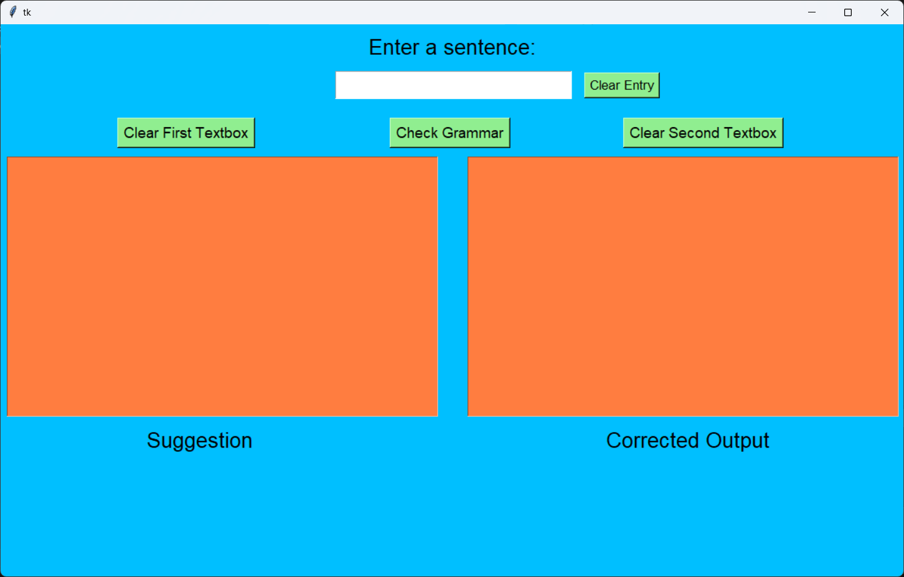

# Grammar Checker App



This is a simple grammar-checking desktop application built with `tkinter`. The user enters a sentence, and the app provides suggestions for grammatical mistakes and a corrected output.

## Features

- **Check Grammar**: Enter a sentence and click "Check Grammar" to identify grammar issues.
- **Clear Fields**: Clear the input or output fields separately using the provided buttons.
- **User-Friendly Interface**: Easy to use, with suggestions shown on the left and corrected output on the right.

## Installation

1. Clone the repository:
   ```bash
   git clone https://github.com/graycracker1/python_grammar_check.git

2. Navigate to the project folder:
    ```bash
    cd grammar-checker-app

3. Install required libraries:
    ```bash
    pip install -r requirements.txt

4. Run the application:
    ```bash
    python grammar_check.py
